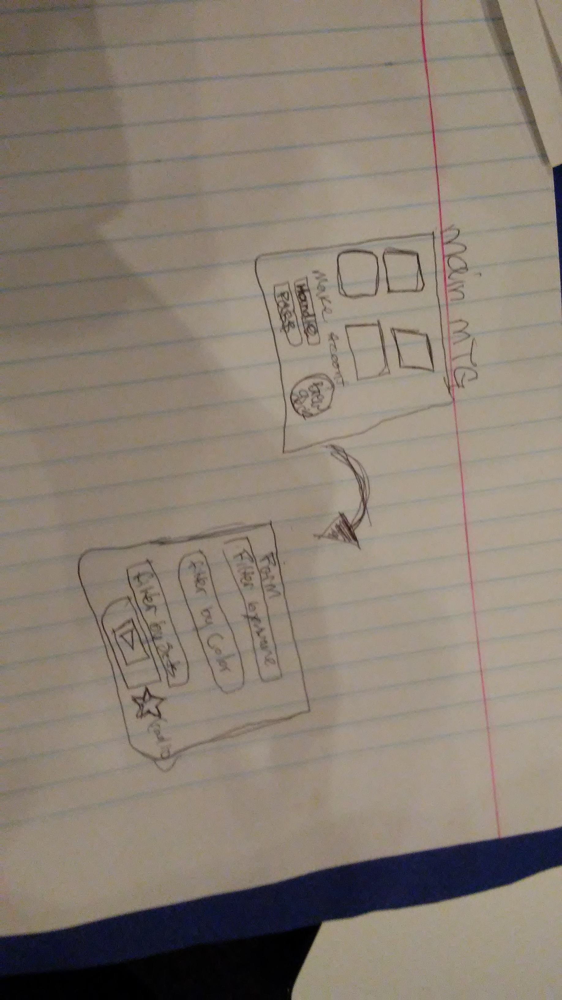

# mtgProject

LEGEND OF COMPLETION: [0]=not done [1]=done

day0-
	A.start strategizing what the site will do. [1]
	B.begin to tinker with the MTG api. [1]
	C.conceptualize what is realistically possible to make within the time constraints. [1]

day1- 
	A. I've drawn some general wireframes and schemaframes. [1]
	B. set up my file structures in directories respectively[config,db,models,routes, and views]. [1]
	C. create db for cards and users. [1]
	D. Set up [Port,'/'route,and dependencies(nodemon,morgan,express,bcrypt,pg-promise,body-parser,methodOveride,EJS)]. [1]
	E. play with api.magicthegathering.io for 20mins[1]

day2-
	A. type out folders [models,routes,controllers].[1]
	B. type out [views] and render a image. [0]
	C. populate the tables on seeds [0]
	D. view the seeds.[n0]
	E. begin CSS. [0]